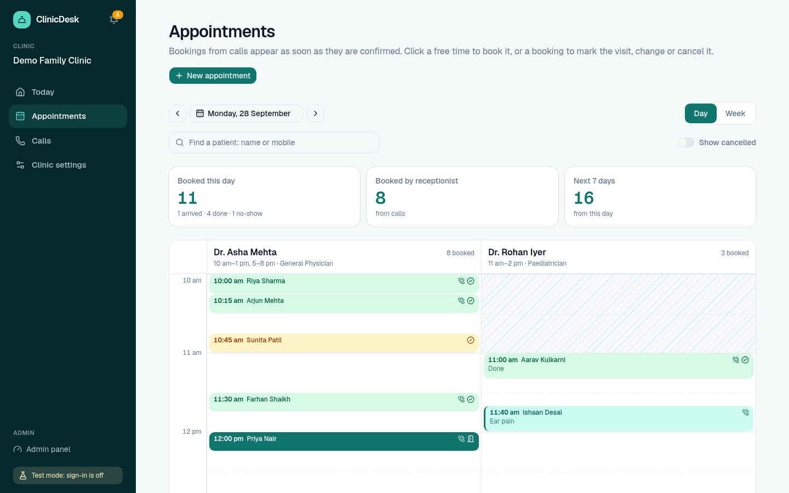
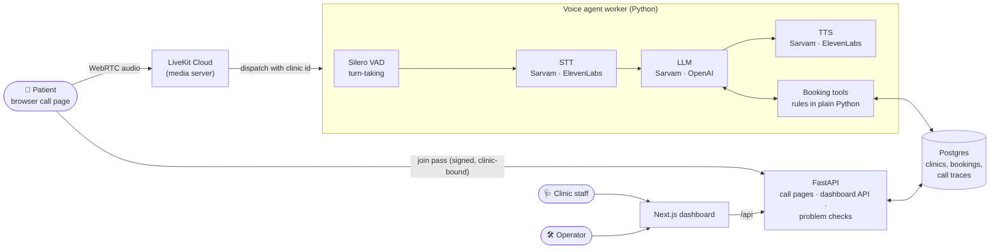
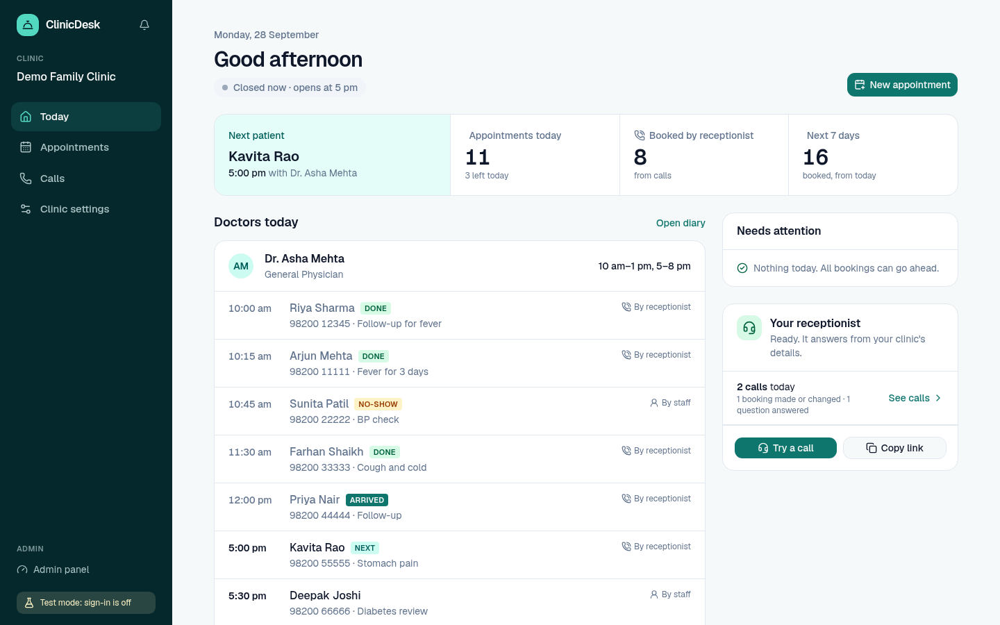
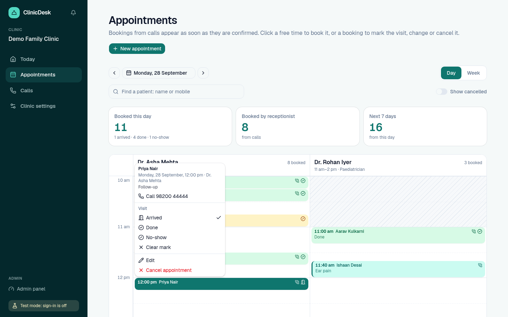
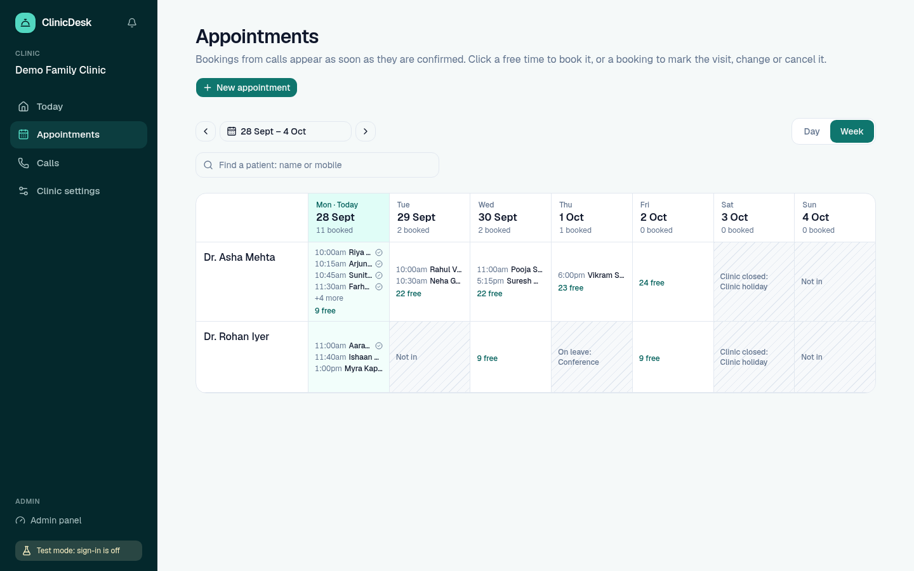
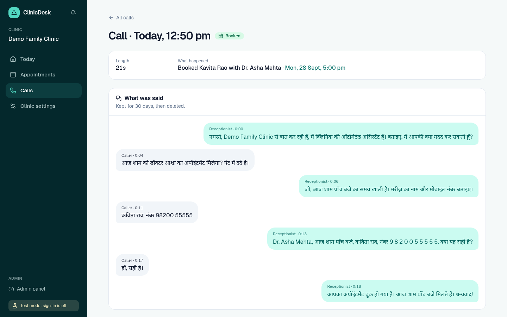
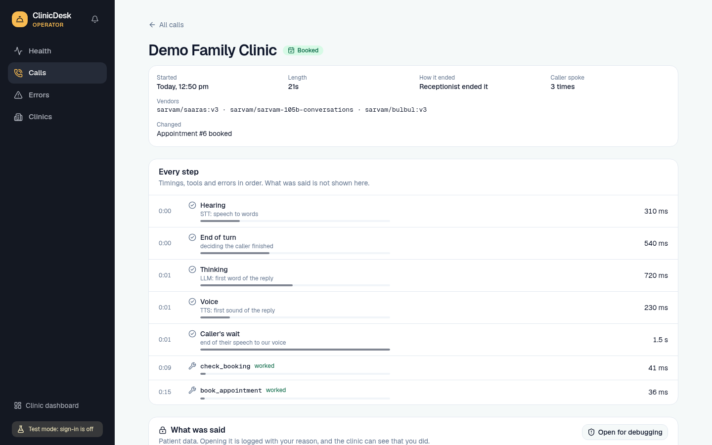
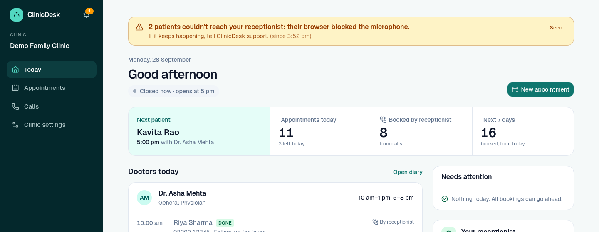
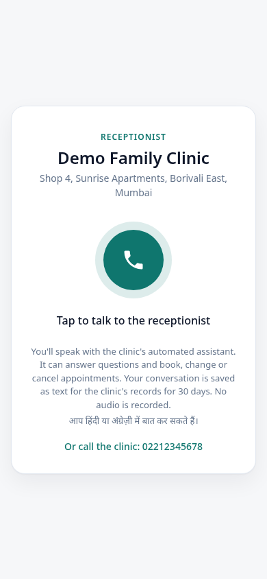
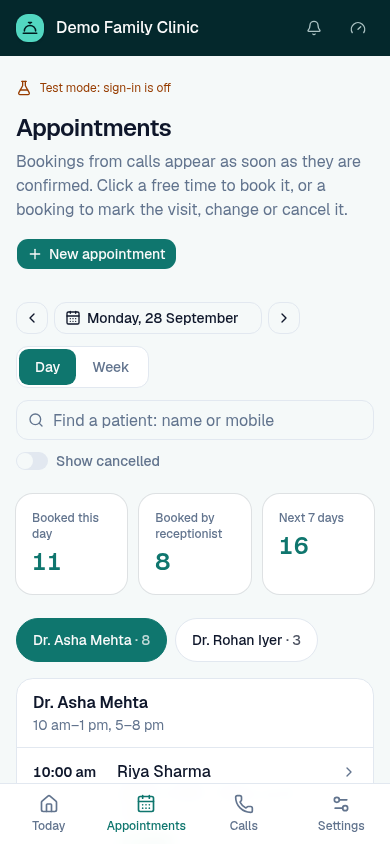

# ClinicDesk: a Hindi voice receptionist for Indian clinics

[](https://github.com/Harsh251005/clinic-voice-agent/actions/workflows/ci.yml)


Patients call and talk to it in **Hindi, English or Hinglish**. It answers
from the clinic's own data (doctors, hours, fees, holidays), **books,
moves and cancels appointments**, and hangs up politely. Clinic staff run
their day in a dashboard. The operator watches every clinic from an admin
panel. Every failure is flagged on screen.

<!-- DEMO VIDEO: add the YouTube link and a GIF here once recorded -->



## What it does

- **A real-time voice agent** on LiveKit. Speech-to-text, the language
  model and the voice are each a vendor you pick with one setting (Sarvam,
  ElevenLabs, OpenAI).
- **Books, moves and cancels appointments by voice.** Every change is
  confirmed with the caller first, and the code enforces it, not the
  prompt.
- **One agent process serves every clinic.** Each call carries the clinic
  it belongs to.
- **A dashboard for the front desk:**
  - today at a glance;
  - a diary with a column per doctor, where you click a free slot to book;
  - visit marks (arrived, done, no-show);
  - every call with what was said.
- **An admin panel for the operator:** each call's step-by-step timings,
  vendor errors, clinic health. It never shows patients unless a reason is
  written down and logged.
- **Problems flagged on every page:** receptionist offline, a vendor
  failing, patients who couldn't get through, setup that stops bookings.
  The clinic reads plain words; the operator reads the technical detail.

## Architecture



- **The call path:** the browser gets a short-lived, signed pass for a
  fresh room bound to one clinic. LiveKit dispatches the worker with that
  clinic's id. Each turn goes VAD → STT → LLM (with tools) → TTS.
- **The rules live in plain Python** (`booking.py`), not in the prompt.
  They are tested without any voice or model.
- **The database guarantees what code can't:** one booking per doctor per
  time, under concurrent callers.

## Engineering highlights

Every point below has a real bug or decision behind it:
[**docs/decisions.md**](docs/decisions.md) tells each story, with the
commit that fixed it.

- **Safety is enforced in code, not in the prompt.** In live runs the model
  booked before the caller confirmed, in 3 of 4 runs. Booking became
  check-then-book: a tool that takes no arguments and refuses until the
  caller has spoken since the read-back. Cancel and reschedule work the same
  way.
- **Testing the way production feeds input.** Speech-to-text passed tests
  and heard nothing on real calls. The live test now streams audio in real
  time, with room noise and an open stream, and it caught both bugs.
- **Indian-language details that matter to the ear:**
  - replies are written in Devanagari, because romanised Hindi is
    mispronounced;
  - a sentence splitter that knows the Hindi full stop "।", so the voice no
    longer changes tone mid-sentence;
  - Hindi time words are written by code ("साढ़े बारह बजे"), never left to
    the model.
- **Concurrency is handled by the database.** A partial unique index makes
  double booking impossible, even with two callers in the same second.
  Visit marks are kept out of the status column so they never free a slot.
- **Multi-tenant security is tested by attack.** Every route that takes a
  row id is checked against the clinic in the URL, and a parametrised test
  tries every row type across clinics.
- **Privacy by design:**
  - no audio is ever stored;
  - transcripts are deleted after 30 days;
  - the operator sees timings and errors, never words, unless they open a
    transcript with a logged reason that the clinic can see.
- **Nothing fails silently.** Worker heartbeats, vendor error bursts,
  failed calls and patients whose call page gave up all become incidents on
  both dashboards: a banner on every page, a bell, and "(!)" in the tab.
- **Vendors are swappable.** One registry per part, and vendor imports are
  confined to one package (a test enforces it). A bad setting fails at
  startup, not on the first call.

## Screenshots

| | |
|---|---|
|  |  |
| **Today**: the front desk's home | **A booking's menu**: visit marks, edit, cancel with Undo |
|  |  |
| **The week at a glance** | **A call, as the clinic sees it**: just the conversation |
|  |  |
| **The operator's trace**: step timings, tools, vendors | **A problem, flagged** on every page until seen |

<p align="center">
  
  &nbsp;&nbsp;
  
</p>
<p align="center"><b>On a phone:</b> the patient's call page, and the diary for staff</p>

## Try it

```bash
docker compose up --build
```

This opens the dashboard at <http://localhost:3000>, with a fictional clinic
and a lived-in day already filled in. No keys are needed to look around.
To talk to the receptionist, put LiveKit and vendor keys in `backend/.env`
(see [`backend/.env.example`](backend/.env.example)) and add
`--profile voice`. The call page is <http://localhost:8080/call/demo-family-clinic>.
Sign-in is off in this demo stack, so keep it on your own machine.

For development without Docker, and for everything the backend does, see
[`backend/README.md`](backend/README.md). To talk to it by text only (no
speech costs): `uv run python main.py console --text`.

## Tests

| Suite | What it covers |
|---|---|
| **Backend**, 410+ tests | Booking rules, the tool gates through a real agent session with a scripted model, the dashboard API including cross-clinic attacks, migrations, call records, incident rules. Every database test also runs on Postgres. |
| **Browser**, 36 tests (Playwright) | The dashboard against the real API: booking into free slots, visit marks, cancel and Undo, search, the week view, phone layout, problems appearing and clearing. |
| **Live evals** (on demand, spends credits) | The real model and voice vendors, graded by an LLM judge: read-back before booking, refusing medical advice, escalating chest pain, replying in the caller's language, an audio round trip. |

CI runs the first two on every push, with no vendor calls.

## Stack

**Voice:** LiveKit Agents 1.8, Sarvam (saaras STT, sarvam-105b, bulbul
TTS), ElevenLabs, OpenAI, Silero VAD.
**Backend:** Python 3.13, FastAPI, SQLAlchemy 2.1 + Alembic, Postgres
(SQLite for development), uv.
**Dashboard:** Next.js 16, React 19, TypeScript, Tailwind, shadcn/ui,
TanStack Query, a typed client generated from the API's OpenAPI schema.
**Quality:** pytest, Playwright, GitHub Actions, Docker Compose.

## Status

Built: the agent, booking, the dashboard, the admin panel, call records,
problem alerts, CI and Docker. Next: phone numbers (telephony, which also
gives caller ID), a backup vendor that takes over mid-call, a richer
patient page, and a pilot with a real clinic.

## Read more

- [`docs/decisions.md`](docs/decisions.md): the engineering decisions and
  the bugs behind them.
- [`docs/system-explained.md`](docs/system-explained.md): a plain-language
  tour of the whole system.
- [`backend/README.md`](backend/README.md): setup, every behaviour, and the
  configuration.
